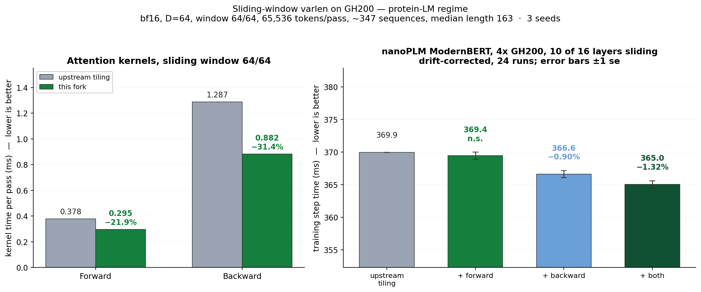
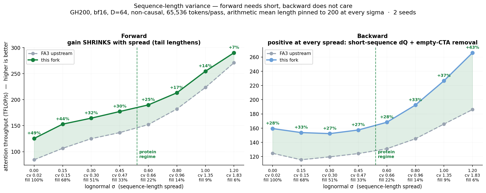
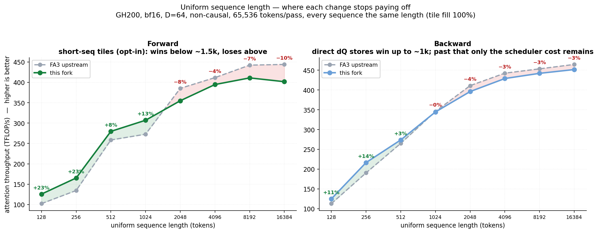

# FlashAttention-3 varlen, tuned for protein language model training

*A fork of [flash-attention](https://github.com/Dao-AILab/flash-attention) for SM90 / Hopper / GH200.*

This fork adapts the FlashAttention-3 **varlen** path (SM90 / Hopper / GH200) to the regime
protein language models actually train in: **many short sequences packed into one pass**.
A UniRef-style batch is ~65,536 tokens made of ~350 sequences with a **median length near 165**
and a long tail out past 900 — nothing like the multi-thousand-token sequences upstream's
defaults are tuned for.

Five changes, all scoped to varlen with `headdim <= 64`. Three for ordinary (global) attention:

1. **Persistent n-block backward scheduler** (default on). Upstream's backward launches a
   *rectangular* grid — every sequence gets as many KV blocks as the *longest* sequence in
   the batch — so on a protein batch **71% of the CTAs are empty tiles that only write
   zeros**. A persistent scheduler walks the real tiles instead: 37,744 CTAs → 132, and 17%
   fewer instructions executed.
2. **Direct dQ stores for short sequences** (default on). When one CTA owns a sequence's
   entire KV range, its dQ tile is already final — so it writes bf16 straight from registers
   and skips the FP32 accumulator clear, the atomic reduction, and the postprocess conversion
   pass entirely. On a protein batch that removes **a third of the preprocess and half of the
   postprocess**.
3. **Short-sequence forward tiles** (opt-in: `FLASH_ATTENTION_SHORT_SEQ_TILES=TRUE`). A narrow
   KV tile (192×80, `IntraWGOverlap=false`) plus a deeper pipeline (`kStages=3`), which suits
   short sequences but **regresses long ones**, hence the flag.

and two for **sliding-window (local) attention**, which every change above used to skip:

4. **A 64×64 forward tile for narrow windows** (default on). Upstream serves local layers from
   the same 192×128 tile it uses for global attention, where most of each KV tile is masked out
   and discarded. Matching the tile to the window is necessary but not sufficient — see below.
5. **The backward path extended to local attention** (default on). The persistent scheduler, the
   length partition and the direct dQ stores were all gated off for `is_local`.


| | upstream | this fork | speedup | in a default build? |
|---|---|---|---|---|
| forward | 149 TFLOP/s | **184 TFLOP/s** | **+23.4%** | no - needs `FLASH_ATTENTION_SHORT_SEQ_TILES=TRUE` |
| backward | 131 TFLOP/s | **164 TFLOP/s** | **+24.9%** | yes |
| **fwd + bwd** | **137 TFLOP/s** | **172 TFLOP/s** | **+25.4%** | forward half needs the flag |

**A default build gives you the two backward changes** — worth **+24.9%** on the backward and
**+17.6%** on fwd+bwd here. The forward number, and the remaining step up to +25.4% combined,
requires the opt-in flag.

GH200 (680 W cap), bf16, D=64, non-causal, 65,536 tokens/pass, mean of 3 seeds. Throughput,
so higher is better. Gradients match upstream, and upstream's own test suite
(`hopper/test_flash_attn.py`) passes — 1584 varlen and 720 non-varlen cases across
headdim 64/96/128/192/256.

**These are attention-kernel numbers.** End to end, on 4 GPUs with FSDP, they are worth
**+1.21%** of step time for a default build and **+1.51%** with the forward flag — because
attention is only 7.8% of a step in this model. Loss is unchanged to four decimals
[(details)](docs/protein_varlen_gh200.md#end-to-end-training).

### Sliding-window attention

ModernBERT-style protein models interleave sliding-window layers with full-attention ones — the
default pattern is one full layer in three, so **10 of 16 layers** use a ±64 window. Those layers
used to fall back to upstream's global-attention tiling and to the original backward path.



Ragged local batches, bf16, D=64, window 64/64, 65,536 tokens/pass, 3 seeds:

| | upstream tiling | this fork | time reduction | in a default build? |
|---|---|---|---|---|
| forward | 0.378 ms | **0.295 ms** | **−21.8%** | yes |
| backward | 1.287 ms | **0.882 ms** | **−31.2%** | yes |

Shrinking the forward tile is necessary but not sufficient. On its own the 64×64 tile is
*slower* than the 192×128 it replaces (0.399 ms vs 0.380 ms): it compiles to 255 registers per
thread, which leaves **one** CTA resident and 7.8% achieved occupancy. Cutting the math warpgroup
to 160 registers lets two CTAs co-reside, and a third pipeline stage covers the shorter per-tile
latency:

| | forward |
|---|---:|
| upstream 192×128 tile | ~0.380 ms |
| 64×64 tile alone | ~0.399 ms — *worse* |
| + 160 registers, 2 blocks/SM, 2× grid | ~0.304 ms |
| + 3 pipeline stages | **~0.298 ms** |

The forward fast path needs both window bounds finite and ≤ 128 per side; wider windows keep
upstream's tile. `local_attention: 128` in a ModernBERT config means ±64, so it qualifies.

**End to end**, on a 4-GPU ModernBERT with 10 of 16 layers sliding, the two together are worth
**~1.3%** of training step time (drift-corrected over 24 runs, se 0.15%). The backward change
carries essentially all of it (~0.9%); the forward's contribution is below what the harness can
resolve, which is expected — forward is about a third of attention time and attention is ~7.8% of
a step. On an all-full-attention config the same binary measures no change, as it should.

Mechanism, the register-pool trap that makes two neighbouring tunings hang, and the dQ padding
invariant that keeps the backward from silently returning wrong gradients:
**[docs/protein_varlen_gh200.md](docs/protein_varlen_gh200.md#part-4--sliding-window-local-attention)**.
Full audit with independent rebuild and reproduction:
[docs/sliding_window_audit.md](docs/sliding_window_audit.md).

### Forward needs short sequences; backward does not

Holding the token budget and the **arithmetic mean length fixed at 200** and varying only the
*spread* of the length distribution separates the mechanisms cleanly:



| lognormal σ | 0.00 | 0.15 | 0.30 | 0.45 | 0.60 | 0.80 | 1.00 | 1.20 |
|---|---|---|---|---|---|---|---|---|
| coeff. of variation | 0.02 | 0.15 | 0.30 | 0.47 | 0.66 | 0.96 | 1.35 | 1.83 |
| max length | 200 | 314 | 482 | 724 | 1062 | 1711 | 2648 | 3937 |
| tile fill | 100% | 68% | 51% | 33% | 22% | 14% | 9% | 6% |
| forward, upstream | 84 | 106 | 125 | 137 | 152 | 182 | 224 | 271 |
| forward, fork | 125 | 153 | 164 | 177 | 190 | 213 | 255 | 290 |
| **forward speedup** | **+49%** | +44% | +32% | +30% | +25% | +17% | +14% | **+7%** |
| backward, upstream | 125 | 116 | 120 | 124 | 131 | 145 | 166 | 186 |
| backward, fork | 159 | 154 | 152 | 157 | 168 | 192 | 227 | 266 |
| **backward speedup** | **+28%** | +33% | +27% | +27% | +28% | +33% | +37% | **+43%** |

All figures TFLOP/s; higher is better.

* The **forward** win is about sequences being *short*. Largest at zero variance (+49%), it
  decays as the tail lengthens, because long sequences prefer upstream's wide KV tile.
* The **backward** wins across the whole range, because its two mechanisms cover different
  parts of it. Direct dQ stores need sequences *short* (mean 200 keeps most of them under the
  ownership threshold at every σ); the persistent scheduler needs them *ragged*, which is why
  the curve turns back up past σ ≈ 0.45 as empty CTAs appear.

A protein corpus (σ ≈ 0.55, CV ≈ 0.6) sits where all three are positive.

### When this fork is slower

Both mechanisms buy short-sequence throughput by giving up something else. **Past roughly 1k
tokens per sequence this fork is slower than upstream.**



Uniform-length varlen, 65,536 tokens/pass, D=64 non-causal:

| uniform seqlen | 128 | 256 | 512 | 1024 | 2048 | 4096 | 8192 | 16384 |
|---|---|---|---|---|---|---|---|---|
| forward, upstream | 102 | 134 | 259 | 273 | 385 | 412 | 442 | 444 |
| forward, fork | 126 | 165 | 280 | 307 | 355 | 395 | 411 | 402 |
| **forward speedup** | **+22.9%** | +22.9% | +8.2% | +12.6% | −7.9% | −4.1% | −7.1% | **−9.5%** |
| backward, upstream | 113 | 191 | 265 | 346 | 411 | 443 | 454 | 465 |
| backward, fork | 125 | 217 | 274 | 345 | 396 | 429 | 442 | 452 |
| **backward speedup** | **+10.6%** | +13.6% | +3.3% | −0.4% | −3.6% | −3.1% | −2.5% | **−2.8%** |

All figures TFLOP/s; higher is better.

Two separate effects:

* **The measured backward crossover is near 1k; the direct-dQ cutoff is 256 tokens.**
  Sequences up to 128 use one N128 KV tile; sequences from 129 to 256 use one N256 tile.
  Longer sequences retain FP32 accumulation and conversion, including those at 512 and 1024.
  The crossover describes the combined fork versus upstream, not the direct-store gate.
  On long uniform batches, no sequence qualifies and there are no empty CTAs to remove;
  the table shows roughly 3% lower backward throughput.
* **The forward regresses past ~1.5k tokens**, which is tile quantization, and is why it is
  behind a flag.

Mechanism, full crossover tables, and the two bugs that make the naive backward port *silently
return wrong gradients*: **[docs/protein_varlen_gh200.md](docs/protein_varlen_gh200.md)**.

### Where this started: GH200 is not an H100

The work began on the [JUPITER](https://www.fz-juelich.de/en/ias/jsc/jupiter) booster, whose
nodes carry four GH200 Grace-Hopper superchips. Measured on one of them:

| | JUPITER GH200 | H100 SXM |
|---|---|---|
| power cap | **680 W** (enforced, flat) | 900 W |
| HBM bandwidth (achieved copy) | **3.64 TB/s** | ~3.35 TB/s |
| bf16 GEMM (achieved) | **~605 TFLOP/s** | ~750–990 TFLOP/s |
| **machine balance** | **~166 FLOP/byte** | **~250 FLOP/byte** |
| SMs / smem per SM | 132 / 228 KB | 132 / 228 KB |

The 680 W cap is a ~24% compute derate with no bandwidth penalty, which leaves the GH200
roughly **35% more bandwidth-rich per FLOP** than an H100. Upstream's forward tile table in
`hopper/tile_size.h` carries the comment *"benchmarked on H100 SXM"*. The starting hypothesis
was that a machine with a materially different compute/bandwidth ratio should prefer a
different tile shape.

**That hypothesis was falsified, and it is worth saying so plainly.** At seqlen 8192 the H100
table is already optimal on GH200 — 37 configurations were swept and nothing beat it — because
FA3 sits at ~97% of the achievable GEMM ceiling there, leaving no headroom for a roofline
argument. The wins in this fork are **not** attributable to the GH200's balance. They come from
the *shape of the workload*: short, ragged, varlen sequences, where the costs are tile
quantization and empty CTAs rather than the FLOP:byte ratio. They would very likely reproduce
on an H100. **No H100 control was available**, so nothing here is claimed as GH200-specific.

The hardware ratio was the question that started the investigation; the answer turned out to
be about sequence-length distribution instead.

### Build

```bash
cd hopper
export FLASH_ATTENTION_SHORT_SEQ_TILES=TRUE   # optional; forward tiles for short seqs
python setup.py install
```

---

### Disclosure

This fork's changes, benchmarks, profiling and documentation were produced with
[Claude Code](https://claude.com/claude-code) running **Claude Opus 5** at high reasoning
effort, working on the JUPITER cluster under my direction and review. Every performance number
in this README and in `docs/` is from an actual run on a GH200 — nothing is estimated or
extrapolated. Correctness claims are backed by gradient checks against per-sequence PyTorch
SDPA and by end-to-end training runs; the specific checks and their limits are listed in
[docs/protein_varlen_gh200.md](docs/protein_varlen_gh200.md).

---

### Upstream

This is a fork of [Dao-AILab/flash-attention](https://github.com/Dao-AILab/flash-attention).
Installation instructions, the full feature matrix, supported architectures and the
FlashAttention-4 / CuTeDSL documentation all live upstream — see the
[upstream README](https://github.com/Dao-AILab/flash-attention/blob/main/README.md).
Everything here other than the three changes described above is upstream's work, under
upstream's [LICENSE](LICENSE).

If you use FlashAttention, please cite the original papers:

- **FlashAttention: Fast and Memory-Efficient Exact Attention with IO-Awareness** —
  Tri Dao, Daniel Y. Fu, Stefano Ermon, Atri Rudra, Christopher Ré
  ([arXiv:2205.14135](https://arxiv.org/abs/2205.14135))
- **FlashAttention-2: Faster Attention with Better Parallelism and Work Partitioning** —
  Tri Dao ([paper](https://tridao.me/publications/flash2/flash2.pdf))
- **FlashAttention-3: Fast and Accurate Attention with Asynchrony and Low-precision** —
  Jay Shah, Ganesh Bikshandi, Ying Zhang, Vijay Thakkar, Pradeep Ramani, Tri Dao
  ([arXiv:2407.08608](https://arxiv.org/abs/2407.08608))
