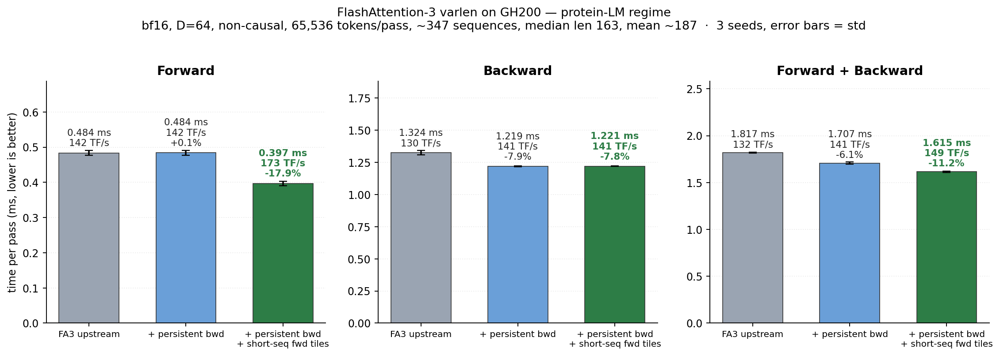

# FlashAttention-3 varlen tuning for protein language models (SM90 / GH200)

This document describes a change to the FlashAttention-3 backward pass on Hopper: replacing
the non-persistent `SingleTileScheduler` with a **persistent n-block varlen tile scheduler**
for the non-causal varlen case. It covers the motivation, the measurements, the two bugs that
make the naive version silently wrong, and the conditions under which the change is a
regression rather than a win.

## Summary

Two changes to the FlashAttention-3 varlen path, both scoped to non-causal `headdim <= 64`:

| | upstream | this fork | speedup |
|---|---|---|---|
| forward | 0.484 ms (142 TF/s) | **0.397 ms (173 TF/s)** | **-17.9%** |
| backward | 1.324 ms (130 TF/s) | **1.221 ms (141 TF/s)** | **-7.8%** |
| **fwd + bwd** | **1.817 ms (132 TF/s)** | **1.615 ms (149 TF/s)** | **-11.2%** |



Protein-LM regime: 65,536 tokens/pass, ~347 sequences, median length 163, mean 187, max ~900
(lognormal, UniRef-like), H=16, D=64, bf16, non-causal. Mean of 3 seeds, 60 timed iterations
each after 20 warmup.

Hardware: a single **GH200** (Grace-Hopper, 132 SMs, 680 W enforced cap, measured 3.64 TB/s
HBM, ~605 TFLOP/s bf16 GEMM), CUDA 13, PyTorch 2.12.

Ablated, so the two changes can be judged separately:

| variant | fwd | bwd | fwd+bwd |
|---|---|---|---|
| upstream | 0.484 ms | 1.324 ms | 1.817 ms |
| + persistent bwd | 0.484 ms (+0.1%) | 1.219 ms (**-7.9%**) | 1.707 ms (-6.1%) |
| + persistent bwd + short-seq fwd tiles | 0.397 ms (**-17.9%**) | 1.221 ms (-7.8%) | 1.615 ms (**-11.2%**) |

The two are independent: the forward flag does not touch the backward, and vice versa.

**Correctness.** Both changes produce gradients identical to the stock kernel
(`dQ` 0.0156 / `dK` 0.0078 / `dV` 0.0078 max abs error vs per-sequence fp32 SDPA — the same
error the stock kernel has), verified up to 1,200 tiles. 30 steps of single-GPU pretraining
give loss identical to 4 decimal places at every step and **bit-identical eval loss**.

---

## Part 1 — Short-sequence forward tiles (opt-in)

`FLASH_ATTENTION_SHORT_SEQ_TILES=TRUE` switches the `headdim <= 64` non-causal forward from
upstream's `{192, 192, RS=false, IntraWGOverlap=true}` to `{192, 80, RS=true,
IntraWGOverlap=false}`, and raises the KV pipeline from `kStages=2` to `3`.

A per-axis sweep at the protein regime (m=192, RS=true, overlap=false, stages=2) shows a smooth
unimodal optimum in the KV tile width:

```
tile_n   32     48     64     80     96    112    128    160    192
TFLOP/s  152.5  167.9  173.7  177.2  175.1  172.4  171.9  161.3  148.8
                              ^^^^^
```

`IntraWGOverlap=false` wins everywhere (+1 to +7 TF/s), `tile_m` 192 > 128 > 64
(175 / 168 / 143), and `kStages` 3 > 4 > 2 (~+1.5 TF/s).

The mechanism is **scheduler load balance across ragged sequences**, not padding arithmetic:
`tile_n` 64, 96 and 192 pad a median-169 sequence identically, yet differ by 25 TF/s.
`tile_n=192` gives exactly one KV iteration and no pipelining (worst, 148.8); the optimum sits
around three iterations. Shared-memory bank conflicts are *not* the constraint — the fastest
config has the *most* conflicts (53.4%) and `tile_n=64` the fewest (18%) while being slower.

### Why it is opt-in: the crossover

This is a *tile-quantization* win and it inverts at long sequence length. D=64 non-causal,
fixed-length varlen, 65,536 tokens per pass:

| seqlen | upstream | short-seq tiles | delta |
|---|---|---|---|
| 128 | 97.9 TF/s | 118.9 | **+21.4%** |
| 256 | 129.5 | 158.4 | **+22.3%** |
| 512 | 258.0 | 268.0 | +3.9% |
| 1024 | 316.3 | 325.0 | +2.8% |
| 2048 | 379.7 | 375.4 | -1.1% |
| 4096 | 430.5 | 402.9 | -6.4% |
| 8192 | 463.4 | 418.7 | -9.6% |
| 16384 | 445.2 | 399.1 | **-10.4%** |

Break-even is near seqlen 1500. Upstream's own comment two lines below the tile table says as
much — *"Good for long seqlen (>= 4k) but suffers from tile quantization at short seqlen"* —
so this is not a bug in upstream's choice, it is a different operating point.

`tile_size_fwd_sm90()` has no `seqlen` parameter and its result becomes *template* parameters,
so the tile is baked per `(headdim, causal, ...)` at compile time. Gating on sequence length
properly would need two instantiations of the kernel plus a host-side dispatch. Until then the
flag defaults to upstream behaviour so nothing regresses silently. `kStages` is tied to the same
flag because a deeper pipeline costs shared memory for *every* SM90 forward config, not just
this one.

---

## Part 2 — Persistent backward scheduler (default on)

### Motivation

The target workload is masked-LM pretraining of a ModernBERT-style encoder, where sequences
are packed varlen with a **mean length around 190 and a long tail**:

```
H = 16 heads, D = 64, 65,536 tokens/batch, 337 sequences
mean seqlen 194, max 815, lognormal(log 176, 0.5)
```

Profiling one fwd+bwd iteration of this shape (total 1.746 ms) gave:

| kernel | ms | share |
|---|---|---|
| `FlashAttnBwdSm90` (main backward) | 0.966 | 55.4% |
| forward recompute | 0.453 | 26.0% |
| `BwdPreprocess` | 0.185 | 10.6% |
| `BwdPostprocessConvertdQ` | 0.136 | 7.8% |

The main backward kernel dominates, and its SASS stall profile **inverts** the forward's:

| stall source | forward | backward |
|---|---|---|
| `MUFU.EX2` (softmax) | 18.5% | 2.0% |
| branch / sync | negligible | **38.3%** |
| `BRA` | — | **25.8%** |
| GMMA | 5.6% | 14.2% |
| global memory | — | 1.7% |

The forward is math-bound on softmax transcendentals. The backward is bound on control flow.

A gate test isolated the cause. Holding the kernel completely fixed and only raising the
median sequence length **176 → 704** moved `BRA` **26.0% → 14.4%** and GMMA **14.6% → 24.4%**.
So the control-flow cost is *per tile* and amortises over longer loop bodies — the short-sequence
regime pays it disproportionately.

---

### What is actually being wasted

The backward's `SingleTileScheduler` launches a **rectangular grid**:

```
grid = ceil_div(max_seqlen_k, kBlockN) × batch × num_heads
```

Every sequence gets as many n-blocks as the *longest* sequence in the batch. Sequences shorter
than the maximum produce CTAs where `m_block_max <= m_block_min`; those CTAs run their prologue,
call `epilogue.store_zero()`, and exit.

For the workload above, with `kBlockN = 128` and `max_seqlen_k = 815` (7 n-blocks):

```
launched CTAs        37,744     (7 × 337 × 16)
real non-empty tiles 10,816     (28.7%)
empty CTAs           26,928     (71.3%)
```

**71% of the grid does no work.** Nsight Compute confirms the launched grid exactly:
`Grid Size = 37,744`, `Waves Per SM = 285.94`.

A persistent scheduler enumerates only the real tiles across a resident grid of one CTA per SM:
**132 CTAs × ~82 tiles each, 1 wave**.

---

### The change

The port is far smaller than it first appears, because most of the machinery already exists
upstream:

* `flash_bwd_kernel_sm90.h` already wraps the whole body in a
  `get_initial_work / is_valid / get_next_work` loop — `SingleTileScheduler` simply runs it once.
* `mainloop_bwd_sm90_tma_gmma_ws.hpp` already defines
  `NumProducerThreads = cutlass::NumThreadsPerWarp * 2` (warp 0 loads K/V/Q/dO, warp 1 runs
  `store_dq`), which is exactly the participant count a persistent scheduler needs.
* `mma()` already tracks the `barrier_KV` phase as `work_idx % 2` and increments `work_idx`.
* The `BwdNamedBarriers::KVEmpty` handshake exists, commented out, with the note:
  *"We're not currently using this bc we're not using persistent scheduler."*

#### Reusing the forward's scheduler over n-blocks

`VarlenDynamicPersistentTileScheduler`'s first template parameter is named `kBlockM`, but it is
only ever used as `ceil_div(seqlen, ·)`. **Passing `kBlockN` makes it decompose over n-blocks** —
no new scheduler and no new metadata kernel are required. The backward's `scheduler_args` already
passes `cu_seqlens_k` and `seqlen_k`, and `Prepared = false` computes block counts from
`cu_seqlens` on the fly.

```cpp
// hopper/flash_bwd_launch_template.h
using SchedulerPersistentBwd = flash::VarlenDynamicPersistentTileScheduler<
    kBlockN, kBlockM, CollectiveMainloop::NumMmaThreads, CollectiveMainloop::NumProducerThreads,
    false /*Split*/, false /*PackGQA*/, true /*WarpSpecialized*/,
    false /*LPT*/, false /*Sort*/, false /*Prepared*/>;

static constexpr bool UsePersistentBwd =
    (Arch >= 90) && Varlen && !Is_causal && !Is_local && !GQA;
```

Barrier IDs do not collide: the scheduler uses cutlass *reserved* barriers
(`StreamkBarrier0/1` → hardware 4, 5), while `BwdNamedBarriers` are user barriers offset by
`ReservedNamedBarrierCount = 8` → hardware 8–15.

#### The work counter

The persistent scheduler's `prefetch_next_work` does
`atomicAdd(params.tile_count_semaphore, 1)`. The backward never allocated one — the lines were
commented out. Both API files need it:

```cpp
// hopper/flash_api_stable.cpp   (and the same in flash_api.cpp)
Tensor tile_count_semaphore = torch::stable::new_zeros(
    q, {1}, std::make_optional(torch::headeronly::ScalarType::Int));
params.tile_count_semaphore = static_cast<int*>(tile_count_semaphore.data_ptr());
```

> **Watch out.** The build uses **`flash_api_stable.cpp`**, not `flash_api.cpp`. Patching only the
> latter compiles and links fine, then faults at runtime with
> `Invalid __global__ atomic of size 4 bytes … Access to 0x0 is out of bounds` inside
> `prefetch_next_work`. Compute-sanitizer names the host frame — read it.

---

### The trap: `TensorStorage` is a union

This is the bug worth remembering, because it produces **silently wrong gradients** and passes
compute-sanitizer cleanly.

`flash_bwd_kernel_sm90.h` declares:

```cpp
struct TensorStorage : cute::aligned_struct<128> {
    union {
        typename CollectiveMainloop::TensorStorage mainloop;   // sQ, sK, sV, sdO, sdS …
        typename CollectiveEpilogue::TensorStorage epilogue;   // sdK, sdV
    };
} tensors;
```

The epilogue's `sdK`/`sdV` **alias the entire mainloop storage**. With a single tile per CTA this
never mattered. With a persistent loop there are two independent races:

1. the producer TMAs K/V/**Q**/dO for work tile `t+1` into memory the epilogue of tile `t` is
   still writing, and
2. the epilogue of tile `t` writes `sdK`/`sdV` over `sQ`/`sK`/`sV`/`sdO` that tile `t+1` needs.

The natural-looking fix — release the buffers at the end of `mma()` — is **wrong**, because the
epilogue runs *after* `mma()` returns. It compiles, runs, reports zero sanitizer errors, and
returns corrupted `dK`/`dV`.

The correct placement is exactly where upstream's commented-out code put it:

| site | action |
|---|---|
| `mma_init()` | `NamedBarrier::arrive(NumMmaThreads + 32, KVEmpty)` — initial credit |
| `load()`, **top, before the Q/dO TMA** | `NamedBarrier::sync(NumMmaThreads + 32, KVEmpty)` |
| `epilogue_bwd.hpp::store()`, after smem is drained | `arrive(NumEpilogueThreads + 32, KVEmpty)` |

Two details matter:

* The producer wait must precede the **Q** TMA, not just the K/V TMA. `sQ` is in the same union.
  Placing it between them (where it superficially belongs, next to the K/V load) still corrupts.
* Varlen takes the **non-TMA/STG** epilogue branch (`Use_TMA = !Varlen && ...`), so the arrive
  goes after the smem→register `flash::copy`, preceded by `fence_view_async_shared()`. The TMA
  branch releases after `tma_store_wait<0>()`.

Credit accounting stays balanced across empty tiles because both sides skip them: the producer
returns before its `sync` when `m_block_max <= m_block_min`, and `store_zero()` does not arrive.

---

### Testing: why the first round of correctness tests proved nothing

Gradients were checked against per-sequence PyTorch SDPA. The initial tests all passed on the
broken version, because **they never exercised persistence at all**: with fewer tiles than SMs,
every CTA receives exactly one work tile and the persistent path is identical to the single-tile
path.

Sweeping the tile count located the bug in a single run:

| tiles | result |
|---|---|
| 32 | correct |
| 132 (= `num_sm`) | correct |
| **160** | **wrong** (15/40 sequences bad) |
| 272 | wrong (37/68) |
| 1200 | wrong (292/300) |

None of the bad sequences had *zero* gradient, which ruled out a tile-mapping bug (missing tiles)
and pointed at state corruption between tiles.

> **Rule:** any test for a persistent scheduler must launch more tiles than the GPU has SMs.

After the fix, the persistent kernel matches the `SingleTileScheduler` control exactly:

```
ctrl   out=0.0078  dQ=0.0156  dK=0.0078  dV=0.0078
pers   out=0.0078  dQ=0.0156  dK=0.0078  dV=0.0078
```

(bf16 tolerances vs fp32 SDPA reference; identical to the stock kernel's own error.)

End-to-end, 30 steps of single-GPU pretraining: **loss identical to 4 dp at every logged step,
`eval_loss` bit-identical (2.9355 / 2.8995), no NaN**. `grad_norm` differs in the 5th digit
(3.7059 vs 3.7060), as expected from a different dK/dV reduction order.

---

### Measurements

#### Main backward kernel (Nsight Compute)

| metric | `SingleTileScheduler` | persistent |
|---|---|---|
| grid | 37,744 CTAs | **132** |
| waves per SM | 285.94 | **1** |
| duration | 1.18 ms | **1.00 ms** |
| **instructions executed** | 231.4 M | **191.5 M (−17.2%)** |
| cycles | 1.540 M | 1.249 M (−18.9%) |
| compute (SM) throughput | 32.8% | 40.4% |
| memory throughput | 44.5% (1.27 TB/s) | 54.0% (1.51 TB/s) |
| executed IPC | 1.19 | 1.17 |
| warp cycles / issued inst | 8.14 | 8.56 |
| registers/thread | 168 | 168 |
| achieved occupancy | 15.14% | 15.63% |

The win is **not** better per-instruction efficiency. IPC is flat and per-warp stalls are
marginally *worse*. The kernel simply executes 17% fewer instructions, because 71% of the CTAs
it used to launch existed only to write zeros.

#### Wall-clock, isolated benchmark

Per fwd+bwd iteration, all FA kernels, median of alternating repeats:

| kernel | ctrl | persistent |
|---|---|---|
| main `FlashAttnBwdSm90` | 0.981 ms | **0.859 ms (−12.5%)** |
| forward recompute | 0.403 | 0.415 |
| `BwdPreprocess` | 0.186 | 0.186 |
| `BwdPostprocessConvertdQ` | 0.137 | 0.137 |
| **total** | **1.712 ms** | **1.603 ms (−6.4%)** |

#### The change is a *dispersion* win, not a short-sequence win

Sweeping the length distribution at constant token count (65,536) and constant `kBlockN = 128`.
"fill" is the fraction of launched CTAs that are non-empty; time is total FA kernel time per
iteration:

| distribution | max | fill | ctrl | persistent | Δ |
|---|---|---|---|---|---|
| uniform 194 | 194 | 100.0% | 1.528 ms | 1.532 ms | **−0.2%** |
| lognormal σ=0.25 | 378 | 64.6% | 1.511 ms | 1.527 ms | **−1.1%** |
| lognormal σ=0.5 | 815 | 28.7% | 1.712 ms | 1.622 ms | **+5.2%** |
| lognormal σ=0.9 | 2779 | 11.5% | 2.588 ms | 2.262 ms | **+12.6%** |
| lognormal σ=1.3 | 2376 | 18.1% | 3.132 ms | 2.897 ms | **+7.5%** |

The benefit tracks the empty-CTA fraction almost monotonically. **At high fill the change is a
small regression** — the `KVEmpty` handshake serialises the producer against the epilogue of the
previous tile, and when there are no empty CTAs to eliminate that serialisation is pure cost.

#### End-to-end

Single-GPU nanoPLM pretraining, warm compile cache, step time at step 20:

```
ctrl  {340.61, 339.49} ms
pers  {339.02, 338.52} ms      →  −0.38%
```

The persistent build is faster in both repeats, but the difference (1.28 ms) is comparable to
the spread within the control arm alone (1.12 ms). **Read this as "no regression, plausibly a
small win", not as a measured speedup.** Attention is a modest fraction of a step whose GEMMs
run in fp8; the kernel-level −12.5% is the result that is actually resolved.

---

---

## Status and limitations

* Gated at compile time to `Arch >= 90 && Varlen && !Is_causal && !Is_local && !GQA`.
  Causal keeps `SingleTileBwdLPTScheduler`; everything else keeps `SingleTileScheduler`.
* **The gate is wrong in principle.** The benefit depends on the *runtime* fill ratio, which the
  host already knows (it has `cu_seqlens` and computes `num_blocks_n`). A runtime switch on
  something like `real_tiles / rectangular_grid < ~0.5` would capture the win without the
  high-fill regression. That is the obvious next step and is not implemented here.
* The empty-tile path under the persistent scheduler is nearly unreachable by construction
  (per-batch block counts are exact), so `store_zero()` is effectively dead code there. It is
  left in place and the credit accounting handles it, but it is **not** covered by the tests
  above.
* Deterministic mode, GQA, split-KV and paged KV are untouched and still use the stock path.
* The forward flag (`FLASH_ATTENTION_SHORT_SEQ_TILES`) is **off by default** and regresses
  seqlen >= 2k; see the crossover table in Part 1. It affects only `headdim <= 64` non-causal,
  but `kStages=3` under the same flag affects every SM90 forward config's shared-memory budget.
* Only tested for `headdim = 64`, bf16, SM90. Other head dims should work — nothing in the
  change is head-dim specific — but they have not been run.

## Reproducing

```bash
# build (SM90, bf16, hdim64, varlen, fwd+bwd)
cd hopper
export FLASH_ATTN_CUDA_ARCHS=90
export FLASH_ATTENTION_SHORT_SEQ_TILES=TRUE   # optional: short-seq forward tiles
for v in SPLIT PAGEDKV APPENDKV LOCAL SOFTCAP PACKGQA FP16 FP8 \
         HDIM96 HDIM128 HDIM192 HDIM256 HDIMDIFF64 HDIMDIFF192 SM80; do
  export FLASH_ATTENTION_DISABLE_$v=TRUE
done
python setup.py build_ext --inplace
```

Note that `setup.py` uses distutils' `newer_group()`, which compares `.cu` sources against the
output `.so` and **ignores headers**. Editing any `.h`/`.hpp` will silently rebuild nothing.
Force it:

```bash
rm -f build/temp.*/instantiations/*.o build/temp.*/*.o
rm -f build/lib.*/flash_attn_3/_C.abi3.so flash_attn_3/_C.abi3.so
touch instantiations/*.cu *.cpp
```
